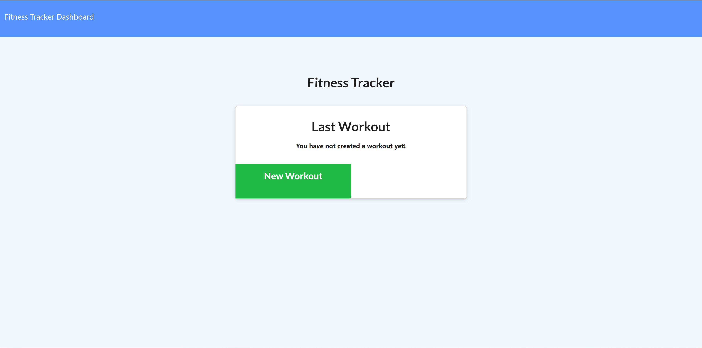
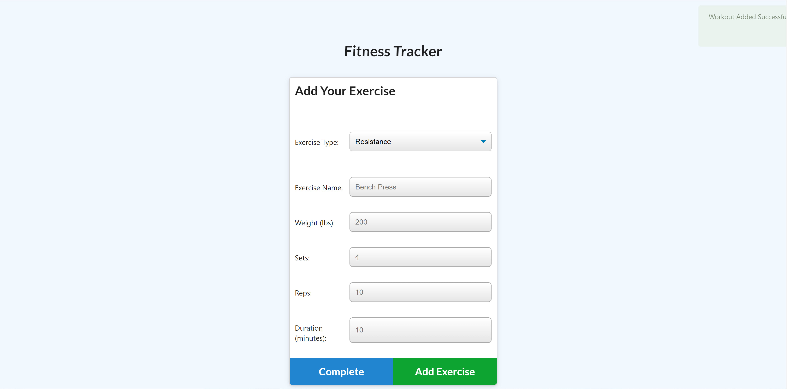
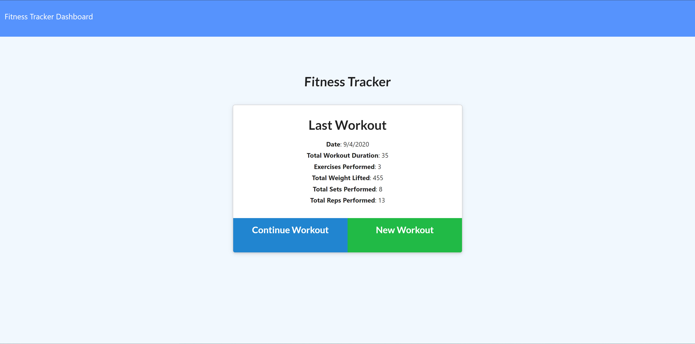

# MBC-WorkoutTracker

## Application & Repository Link

###### [Application Link](https://fast-falls-29904.herokuapp.com/)

###### [Repository Link](https://github.com/Suji-GitH/MBC-WorkoutTracker)

## Content
- [Overview](#Overview)
- [Acceptance Criteria](#Acceptance-Criteria)
- [Application Screens](#Application-Screens)
- [Installation](#Installation)
- [Credits](#Credits)

## Overview

```
As a user, I want to be able to view create and track daily workouts. I want to be able to log multiple exercises in a workout on a given day. I should also be able to track the name, type, weight, sets, reps, and duration of exercise. If the exercise is a cardio exercise, I should be able to track my distance traveled.
```

## Acceptance Criteria

When the user loads the page, they should be given the option to create a new workout or continue with their last workout.

The user should be able to:

  * Add exercises to a previous workout plan.

  * Add new exercises to a new workout plan.

  * View the combined weight of multiple exercises on the `stats` page.

## Installation

1. Download/Clone this GitHub repository.
2. Install dependencies via npm i. 
3. Run the app through node.js by npm start.

## Application-Screens

###### App Screenshots

Landing Page


Add Exercise


Completed Exercise


Dashboard


## Credits

- Heroku
- MongoDB
- Mongooes
- Morgan
- node.js
